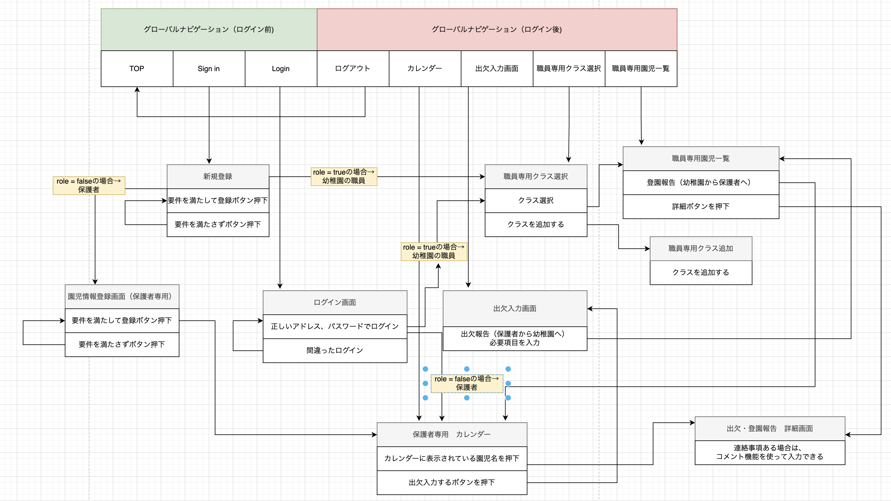

# README 

## 開発言語 
- Ruby 3.0.1  
- Rails 6.0.3  
## 就業Termの技術 
-  device機能
-  Ajaxを使ったコメント機能
## カリキュラム外の技術 
-  SimpleCalendar
## 実行手順 
```bash
$ git clone git@github.com:ayaka2209/original_app.git    
$ cd original_app    
$ bundle install 
$ rails db:create && rails db:migrate 
$ rails s  
 ``` 

## カタログ設計 
https://docs.google.com/spreadsheets/d/1GIFf8tUgpVn1lQ9gzNSdFMrNYroTgPIGzhoj6KDM5sc/edit#gid=1947178936    

## テーブル定義書  
https://docs.google.com/spreadsheets/d/1GIFf8tUgpVn1lQ9gzNSdFMrNYroTgPIGzhoj6KDM5sc/edit#gid=1947178936    
## ワイヤーフレーム 
https://www.figma.com/file/xNuncxD8qo6AdRvqC2AmdA/%E7%84%A1%E9%A1%8C?node-id=4%3A23&t=R1jOr1EUTZf7YXgp-0    
## ER図  
 
### 画面遷移図
 


